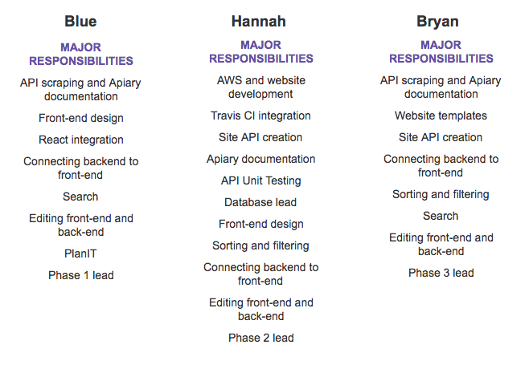

## streamGlean
 
Hannah Perry, Blue Madrigal, Bryan Bernal

---

###OUR GROUP

---

### Responsibilities

---

### <b>Demonstration</b>
 
### Navigate
 

---

### <b>Demonstration</b>
 
### Search
 

---

### <b>Demonstration</b>
 
### Edit
 

---

WHAT DID WE DO WELL?

- Front-End Design
- Filtering
- Sorting

---

WHAT DID WE LEARN?

- AWS
- Flask
- SQLAlchemy
- React

---

WHAT CAN WE DO BETTER?

- Search
- Server-Side Validation
- Load Times

---

WHAT PUZZLES US?

- React
- Whoosh

---

###What did they do well?

- Each page loads very fast
- Filtering/Sorting work very well
- Album artwork is consistent in size
- Pages for adding models are very clean and pleasant to look at
- Search results have nice looking tabs to filter results by model
- UI elements that are easy to click or browse through

---

###What did we learn from their website?

- A page can load fast, but still feel a little slow if its content takes a while to load in images.
- Header/label size and color matter a lot in UI design.

- Having many options for filtering makes finding content much more convenient.

---

###What can they do better?

- Model images could load faster.
- Smoother transitions when browsing through models.
- Model instance pages could be formatted better

- More consistency in UI element design.
- Models other than albums are not consistent in size.

---

###What puzzles us about their website?

- There doesn't seem to be a real mobile version of the site.

---

# QUESTIONS?
